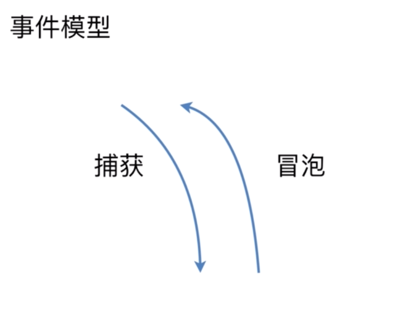
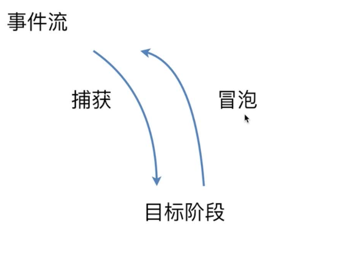
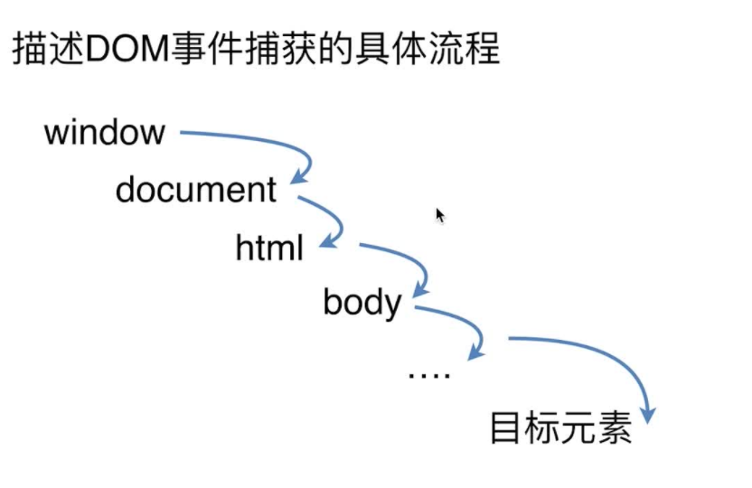

# DOM事件

## 基本概念

- DOM事件级别
- DOM事件模型
- DOM事件流
- 描述DOM事件捕获的具体流程
- Event对象的常见应用
- 自定义事件

### DOM事件级别

**DOM0**
```javascript
element.onclick = function(){};
```

**DOM2**
```javascript
element.addEventListener('click', function(){}, false);// 第三个参数默认为false：表示为事件冒泡阶段触发。设置为true：表示为事件捕获阶段触发
```

**DOM3**
```javascript
element.addEventListener('keyup', function(){}, false);
```

### DOM事件模型

- 捕获
- 冒泡



### 事件流

浏览器在当前页面与用户的交互过程，分为以下三个阶段：



1. 捕获
2. 目标阶段（事件通过捕获到达目标元素）
3. 冒泡（事件从目标元素上传到window对象）

### 描述DOM事件捕获的具体流程



1. window: window
2. document: document
3. html: document.documentElement
4. body: document.body
5. ...（父级元素到子级元素···）
6. 目标元素

_**冒泡的具体流程同上倒序**_

### Event对象的常见应用

1. event.preventDefault()阻止默认行为
2. event.stopPropagation 阻止冒泡
3. event.stopImmediatePropagation() 事件响应优先级 （a响应函数中阻止B事件）
4. event.currentTarget 事件代理（父级）
5. event.target 当前被点击的元素

### 自定义事件

```javascript
var document.getElementById('ev')
var eve = new Event('custome');
ev.addEventListener('custome', function(){
    console.log('custome');
});
ev.dispatch(eve);
```