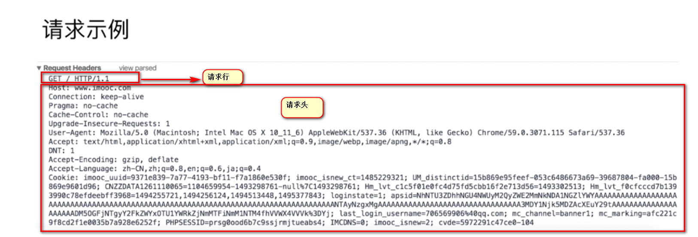
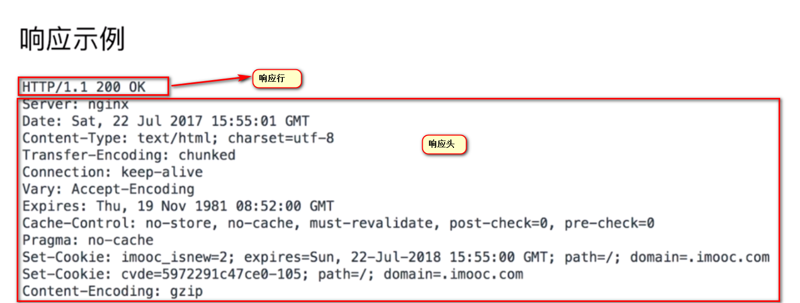
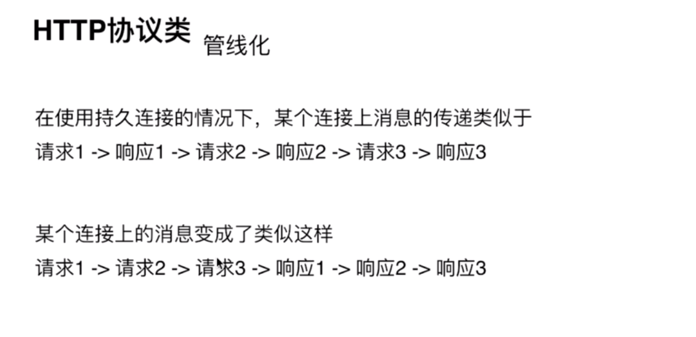
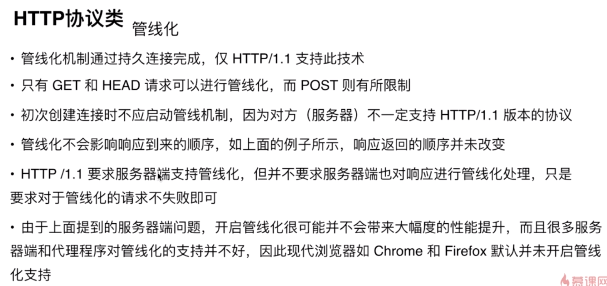

# HTTP协议类

- HTTP协议的主要特点
- HTTP报文的组成部分
- HTTP方法
- POST和GET的区别
- HTTP状态码
- 什么是持久链接
- 什么是管线化

## 1、HTTP协议的主要特点

* 简单快速
* 灵活
* 无连接：链接一次就断开，不会保持连接
* 无状态：两次连接是没有状态来区分的

## 2、HTTP报文的组成部分

* 请求报文
    1. 请求行：http方法、页面地址、http协议、版本
    2. 请求头：一组键值对（key: value）
    3. 空行
    4. 请求体

* 响应报文
    1. 状态行
    2. 响应头
    3. 空行
    4. 响应体

## 3、HTTP方法

- GET：获取资源
- POST：传输资源
- PUT：更新资源
- DELETE：删除资源
- HEAD：获取报文首部

## 4、POST和GET的区别

- GET在浏览器回退时是无害的，而POST会再次提交请求
- GET产生的URL地址可以收藏，而POST不可以
- GET请求会被浏览器主动缓存，而POST不会，除非手动设置
- GET请求参数会被完整保留在浏览器历史记录中，而POST中的参数不会被保留
- GET请求在URL中传送的参数是有长度限制的，而POST没有限制
- GET参数通过URL传递，POST放在Request body中
- Get请求只能进行URL编码，而POST支持多种编码方式
- GET比POST更不安全，因为参数直接暴露在URL上，所以不能用来传递敏感信息

## 5、HTTP状态码

**1xx：**指示信息
**2xx：**成功
**3xx：**重定向
**4xx：**客户端错误
**5xx：**服务器错误

常见状态码

- 200 OK：客户端请求成功
- 206 Partial Content：客户发送了一个带有Range头的GET请求，服务器完成了它
- 301 Moved Permanently：所有请求的页面已经转移至新的URL
- 302 Found：所有请求的页面已经临时转移至新的URL
- 304 Not Modified：客户端有缓冲的文档并发出了一个条件性的请求，服务器告诉客户，原来缓冲的文档还可以继续使用
- 400 Bad Request：客户端请求有语法错误，不能被服务器所理解。
- 401 Unauthorized：请求未经授权，这个状态代码必须和WWW-Authenticate报头域一起使用。
- 403 Forbidden：服务器收到请求，但是拒绝提供服务。
- 404 Not Found：请求资源不存在，举个例子：输入了错误的URL。
- 500 Internal Server Error：服务器发生不可预期的错误。
- 503 Server Unavailable：服务器当前不能处理客户端的请求，一段时间后可能恢复正常。

## 6、持久连接（HTTP协议从1.1版本开始支持的）

    HTTP协议采用“请求-应答”模式，当使用普通模式，即非Keep-Alive模式时，每个请求-应答客户和服务都要新建一个连接，完成之后立即断开（HTTP协议为无连接的协议）

    当使用Keep-Alive模式（又称持久连接、连接重用）时，Keep-Alive功能时客户端到服务端的连接持续有效，当出现对服务器的后继请求时，Keep-Alive功能避免了建立或者重新建立连接

## 7、管线化

