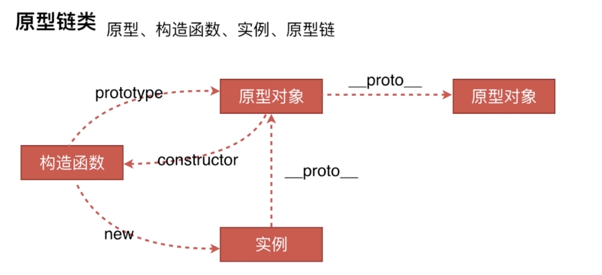
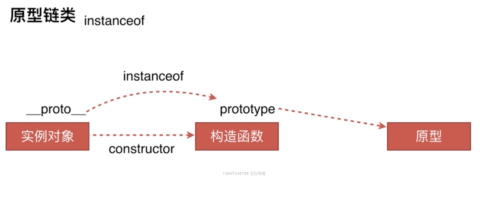
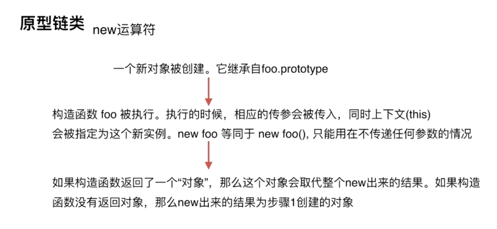

# 原型链类

- 创建对象有几种方法
- 原型、构造函数、实例、原型链
- instanceof的原理
- new运算符

## 1、创建对象的几种方法

1. 字面量创建
```javascript
var o1 = { name: 'o1' };
var o11 = new Object({ name: 'o11' });
```

2. 显示的构造函数创建
```javascript
var M = function(name){
    this.name = name;
};
var o2 = new M('o2');;
```

3. Object.create()
```javascript
var p = {name: 'p'};
var o3 = Object.create(p);
```


## 2、原型、构造函数、实例、原型链



原型链：从一个实例对象向上找构造这个实例相关联的对象，然后再向上找创建它的原型对象，以此类推一直找到Object.prototype原型对象终止，Object.prototype为原型链的顶端。

原型链是通过prototype和\_\_proto\_\_实现查找过程的

**只有函数有prototype属性，只有对象实例有\_\_proto\_\_属性，函数也是对象**


## 3、instanceof原理

```javascript
var M = function(name){
    this.name = name;
}

var o = new M('o');

o instanceof M;
// 等价于
o.__proto__ === M.prototype; // true
M.prototype.__proto__ === Object.prototype; // true

o instanceof Object; // true
M.__proto__ === Function.prototype; // true
M.__proto__ === Object.__proto__; // true

// 判断对象o是哪个构造函数实例时不能用instanceof，应该使用如下方法
o.__proto__.constructor === M; // true
o.__proto__.constructor === Object; // false


```



## 4、new运算符

